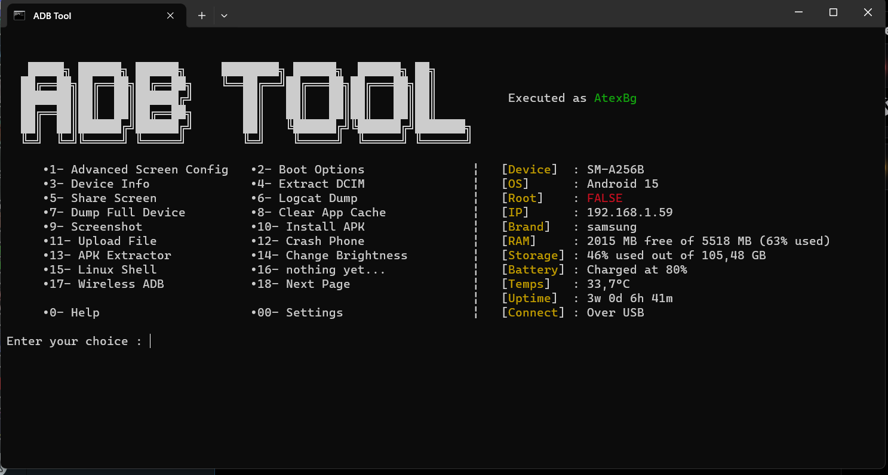

# **ADB Tool** by *AtexBg*
### Version 0.2 (W.I.P)


## Features :
- Integrated install of ADB
- Interactive CLI menu with colors
- Automated detection of device
- Loading loop if no device detected
###  Fetching of **the following device informations**:
```
[Device name]
[Android version]
[Root state]
[IP address]
[Phone brand]
[Free/Total RAM]
[Used/Total storage]
[Battery Charge]
[Phone Temperature]
[Device Uptime]
[Connect Mode (USB or TCPIP)]
```
- Integrated usage of [scrcpy](https://github.com/Genymobile/scrcpy) for screen mirroring
- Change screen resolution and DPI
- Dump all pictures/videos from device
- Clear app cache
- Dump logcat contents
- Upload files to device
- Auto-connect device to TCPIP
- Change brightness
- Install APKs
- Reboot into Android/Recovery/Bootloader
- Remotely crash phone (cuz why not)
- Display Windows username 
- Detect if executed as administrator
- Logs of every action
- Auto-make of I/O and logs folders
- More coming soon...

## USAGE :
Just extract the `*.zip` archive and execute the **main.bat** file, then enter the number of the feature you want to use.

## ISSUES :
- Program softlock if device is connected on USB and TCPIP at the same time
- RAM used percentage innacurate
- Some device infos may not work on some devices
- Script may not even work on old Android devices (tested with only one phone)
- And no Linux support :sob:

## TODO :
- Add more features
- Fix TCPIP issues
- Fix RAM inacurrate percentage
- Make files uploads/downloads easier 
- Auto-Updater (?)
- And obviously make a Linux port 
